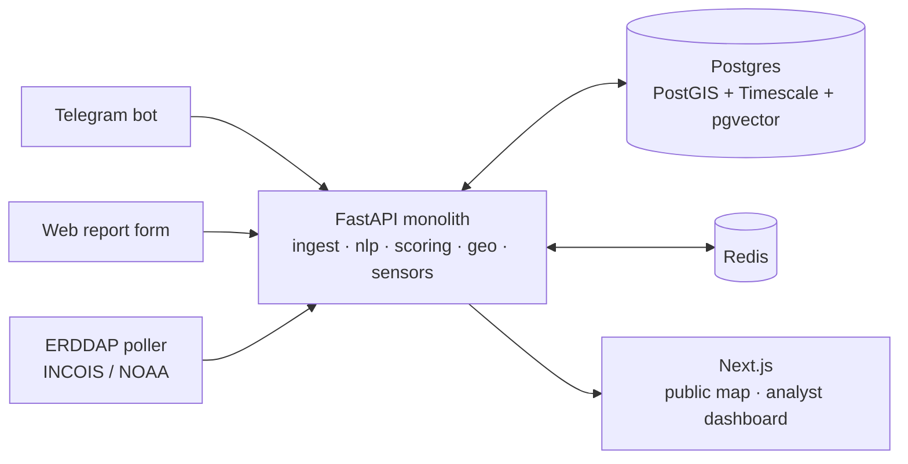

# OceanPing 🌊

**Coastal hazard intelligence: crowdsourced reports, cross-verified against live ocean instruments, on a real-time map.**

Citizens report coastal hazards (flooding, storm surge, high waves, oil spills…) via **Telegram bot or web**, in **any language**. Every report gets a **computed confidence score** — never taken on faith — by fusing four independent signals:

| Signal | Weight | What it checks |
|---|---|---|
| Reporter trust | 0.25 | Waze-style ladder: verified history raises it, debunked reports lower it |
| Spatiotemporal coherence | 0.30 | Independent nearby reports (same H3 cell ± 1 ring, ±30 min) |
| Instrument corroboration | 0.30 | Live ERDDAP tide gauges / buoys showing hazard-consistent anomalies |
| Media forensics | 0.15 | pHash recycled-image check, EXIF GPS/time vs. claimed location |

**Hard rule: no citizen-only escalation.** Report volume alone can never auto-escalate an event — "corroborated" requires instrument agreement, and "verified" requires a human analyst. Every score change and status transition is written to an **append-only, hash-chained audit log**, so any decision can be reconstructed and defended after the fact.

## Architecture



- **NLP**: multilingual embedding classifier (sentence-transformers MiniLM) matched against per-hazard prototype phrases in English/Hindi/Tamil incl. romanized code-mixed text; keyword fallback when the model is unavailable. Semantic + spatial dedup merges duplicate reports into **incidents** — the merge count becomes a corroboration signal instead of analyst noise.
- **Geo**: H3 res-8 indexing, HDBSCAN hotspot clustering, GeoJSON APIs. Public map shows **verified reports only, fuzzed to cell level** — exact coordinates are analyst-only.
- **Sensors**: config-driven ERDDAP tabledap poller (`backend/app/modules/sensors/stations.json`) into a TimescaleDB hypertable; rolling z-score anomaly detection feeds the scoring engine.
- **Module seams mirror the target microservice split** (ingest / nlp / scoring / geo / sensors), so scaling out later is a refactor, not a rewrite.

## Quickstart

```bash
cp .env.example .env      # defaults work out of the box
docker compose up --build
```

| URL | What |
|---|---|
| http://localhost:3000 | Public live map |
| http://localhost:3000/report | Citizen web report form |
| http://localhost:3000/analyst | Analyst dashboard (default: `analyst` / `oceanping-dev`) |
| http://localhost:8000/docs | API (OpenAPI) |

First backend startup downloads the ~470 MB embedding model into a cached volume; with no network (or `NLP_MODE=keyword`) it degrades gracefully to the keyword classifier.

### Run a disaster drill (no disaster required)

```bash
python scripts/drill.py
```

Injects 7 days of calm tide-gauge baseline + a storm-surge spike at a synthetic Chennai station, submits ~14 multilingual citizen reports around Marina Beach, forces a pipeline tick, and prints the confidence picture: reports cluster into incidents, the gauge anomaly corroborates them, one gets analyst-verified onto the public map, and the audit chain is checked end-to-end. Watch it live on the analyst dashboard while it runs.

### Telegram bot (optional)

Create a bot with [@BotFather](https://t.me/botfather), put the token in `.env` (`TELEGRAM_BOT_TOKEN=…`), then:

```bash
docker compose --profile bot up -d
```

`/report` walks through location → hazard type → description (any language) → photo. Reports land in the exact same pipeline as the web form.

### Live instrument feeds

`backend/app/modules/sensors/stations.json` ships with a known-good NOAA CoastWatch ERDDAP buoy (NDBC 46026) as a live demo feed plus a disabled INCOIS ERDDAP template — fill in a dataset id from https://erddap.incois.gov.in/erddap and set `"enabled": true` to corroborate Indian-coast reports with real gauges.

## Tests

```bash
cd backend && pytest            # or: docker compose run --rm backend pytest
```

Covers the scoring weights and escalation gate, audit-chain tamper detection, anomaly z-scores, H3 assignment, dedup merge rules, and the multilingual keyword classifier.

## Repo layout

```
backend/app/modules/
  ingest/    report API + Telegram bot + media forensics
  nlp/       language ID, embedding classifier, incident dedup
  scoring/   confidence engine, trust ladder, hash-chained audit log
  geo/       H3, HDBSCAN hotspots, GeoJSON map APIs
  sensors/   ERDDAP poller + anomaly detection
  analyst/   review queue, verify/reject, audit endpoints
  drill/     synthetic-event injection (drill mode)
frontend/    Next.js — public map, report form, analyst dashboard
scripts/     drill.py (stdlib-only end-to-end drill)
```

## Roadmap

Full gap-based implementation plans for every blueprint phase live in **[docs/plans/](docs/plans/README.md)** — start with the index, and read [phase-0-mvp-kernel.md](docs/plans/phase-0-mvp-kernel.md) for the as-built record of what exists today. Ahead: tiered alerting + delivery channels (phase 1), satellite fusion + WhatsApp/IVR + fisherman mode + RAG chatbot + evacuation routing (phase 2), inundation modeling + auto-SITREPs + mobile app + the microservice split (phase 3), and CAP interop + open data + multi-state scale (phase 4). The kernel here — fused, cross-verified, auditable hazard intelligence — is what everything else compounds on.
